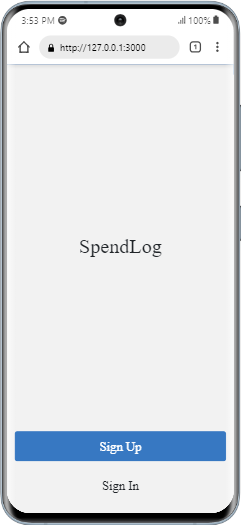
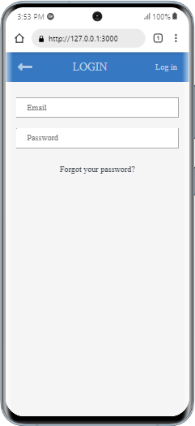
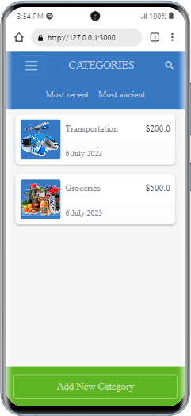
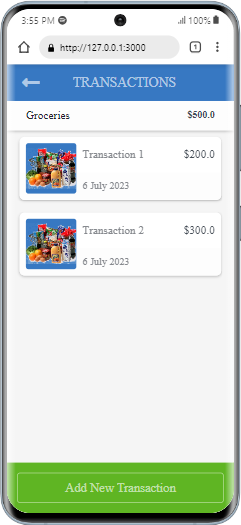
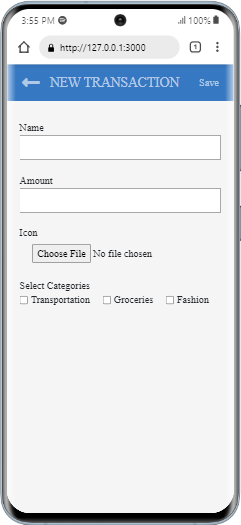

# 📗 Table of Contents

- [📖 About the Project](#about-project)
  - [🛠 Built With](#built-with)
    - [Tech Stack](#tech-stack)
    - [Key Features](#key-features)
    - [Screenshots](#screenshots)
    - [Live Demo](#link-demo)
- [💻 Getting Started](#getting-started)
  - [Setup](#setup)
  - [Prerequisites](#prerequisites)
  - [Install](#install)
  - [Usage](#usage)
  - [Run tests](#run-tests)
  - [Deployment](#triangular_flag_on_post-deployment)
- [👥 Authors](#authors)
- [🔭 Future Features](#future-features)
- [🤝 Contributing](#contributing)
- [⭐️ Show your support](#support)
- [🙏 Acknowledgements](#acknowledgements)
- [📝 License](#license)

# 📖 SpendLog <a name="about-project"></a>

A web application for management of your expenses. The application groups related transactions under categories for ease of visualizing.

## 🛠 Built With <a name="built-with"></a>

### Tech Stack <a name="tech-stack"></a>

<details>
  <summary>Client</summary>
  <ul>
    <li>HTML(erb), CSS</li>
  </ul>
</details>

<details>
  <summary>Server</summary>
  <ul>
    <li>Ruby-on-Rails</li>
  </ul>
</details>

<details>
<summary>Database</summary>
  <ul>
    <li>Postgress</li>
  </ul>
</details>

### Key Features <a name="key-features"></a>

- Register and login
- Category List (Home page)
  - List all caegories for a user
  - Add New Category, to create new category
- Category detail page (Transactions)
  - List all transactions under a category
  - Add New Transaction, to create new transaction

<p align="right">(<a href="#readme-top">back to top</a>)</p>

### Screenshots <a name="screenshots"></a>

<div align="center">
  
  
  
  
  
</div>

<p align="right">(<a href="#readme-top">back to top</a>)</p>

### Live Demo <a name="live-demo"></a>

[SpendLog Live Demo](https://spendlog.onrender.com)

<p align="right">(<a href="#readme-top">back to top</a>)</p>

## 💻 Getting Started <a name="getting-started"></a>

To get a local copy up and running, follow these steps.

### Prerequisites

In order to run this project you need: any web-browser.

### Setup

Clone this [repo](https://github.com/adamilare/spendlog.git) to your desired folder.

```
    git clone https://github.com/adamilare/spendlog.git
```

### Install

Run from a terminal

```
    cd spendlog
    bundle install
```

### Usage

**To run the project follow the following instruction:-**

```
    rails db:migrate
    rails s
```

### Run tests

To run tests, using RSpec

```
  rspec spec
```

### Deployment

You can deploy this project using: [render](https://render.com/).

<p align="right">(<a href="#readme-top">back to top</a>)</p>

## 👤 Author <a name="authors"></a>

👤 **Damilare Adepoju**

- GitHub: [@githubhandle](https://github.com/adamilare)
- Twitter: [@twitterhandle](https://twitter.com/mailtodare)
- LinkedIn: [LinkedIn](https://linkedin.com/in/damilareadepoju)
- GitUp Page: [My Page](https://adamilare.github.io/)

## 🔭 Future Features <a name="future-features"></a>

- [ ] Searches for categories and transactions
- [ ] Expenses analysis

<p align="right">(<a href="#readme-top">back to top</a>)</p>

## 🤝 Contributing <a name="contributing"></a>

Contributions, issues, and feature requests are welcome!

Feel free to check the [issues page](../../issues).

<p align="right">(<a href="#readme-top">back to top</a>)</p>

## ⭐️ Show your support <a name="support"></a>

If you like this project give a ⭐️.

<p align="right">(<a href="#readme-top">back to top</a>)</p>

## 🙏 Acknowledgments <a name="acknowledgements"></a>

I would like to thank Microverse for this project and [Gregoire Vella on Behance](https://www.behance.net/gregoirevella) for the original design idea.

<p align="right">(<a href="#readme-top">back to top</a>)</p>

## 📝 License <a name="license"></a>

This project is [MIT](./LICENSE) licensed.

<p align="right">(<a href="#readme-top">back to top</a>)</p>
